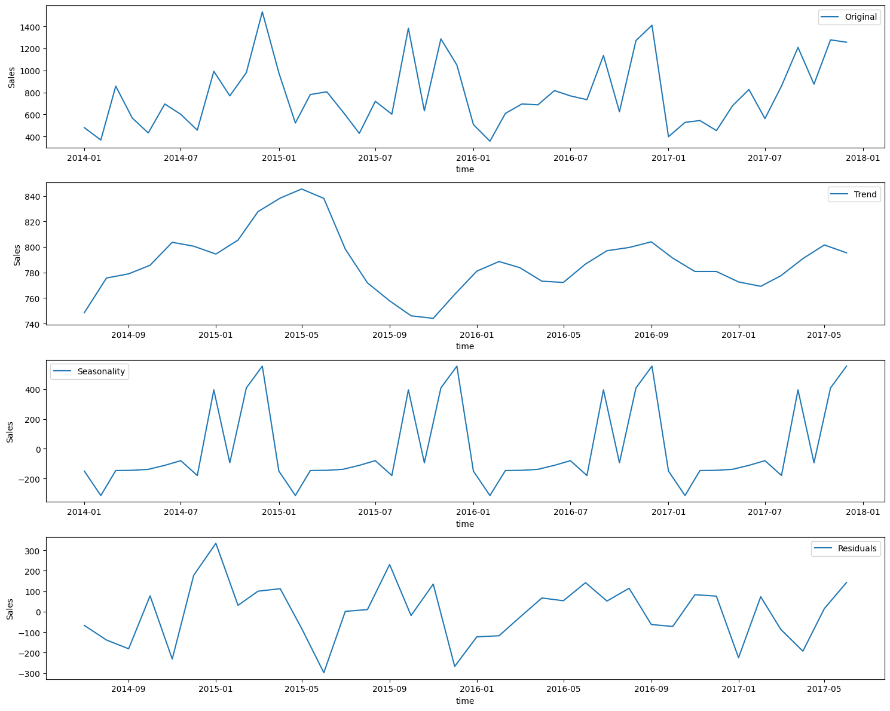
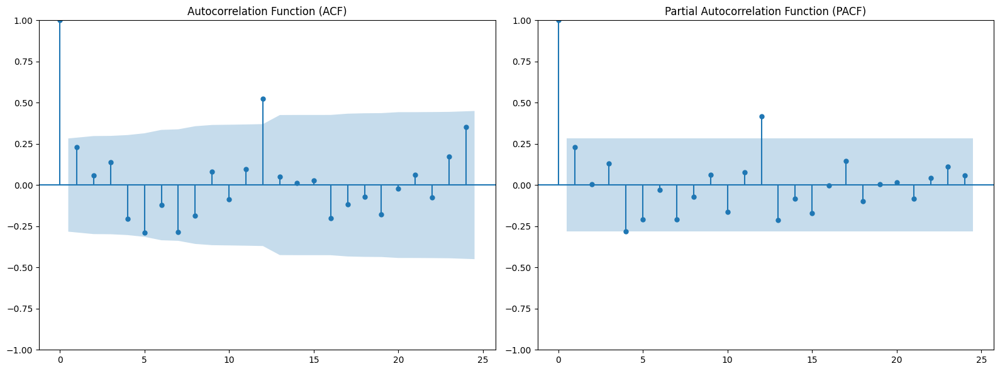
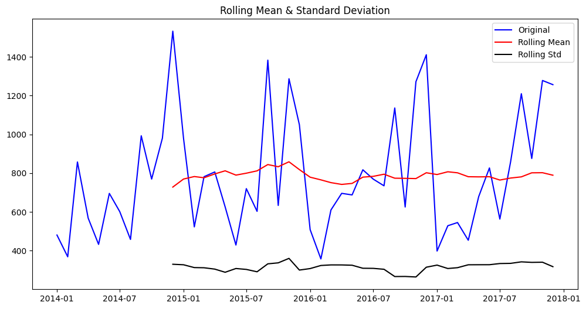
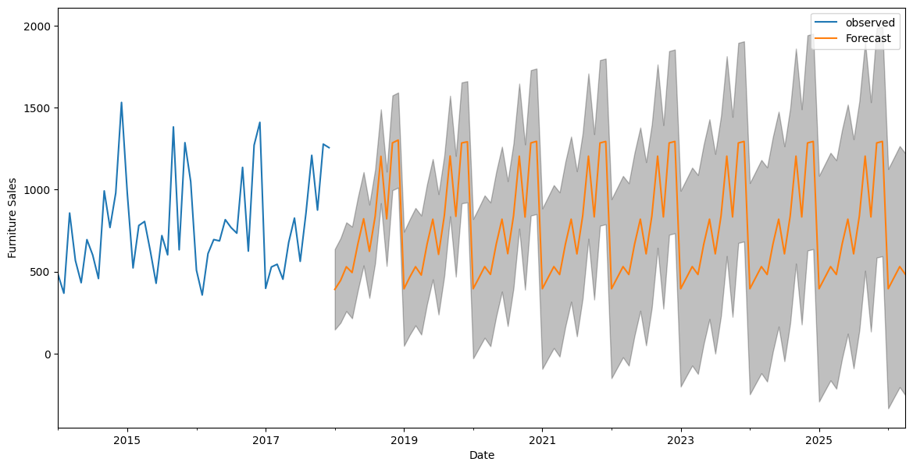
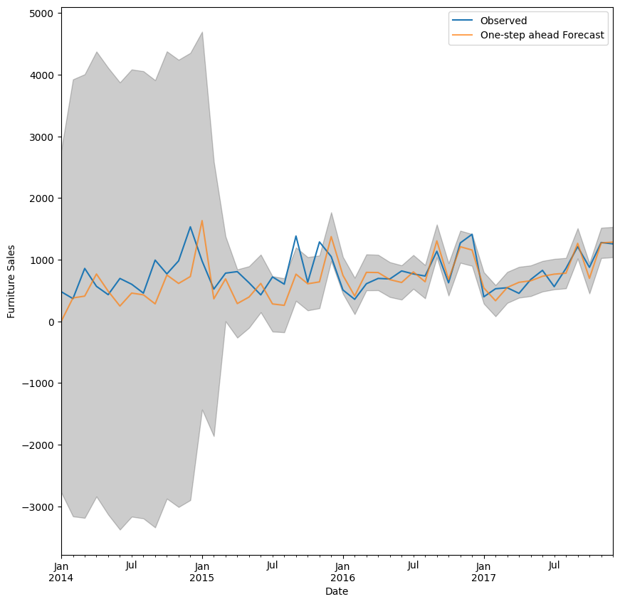
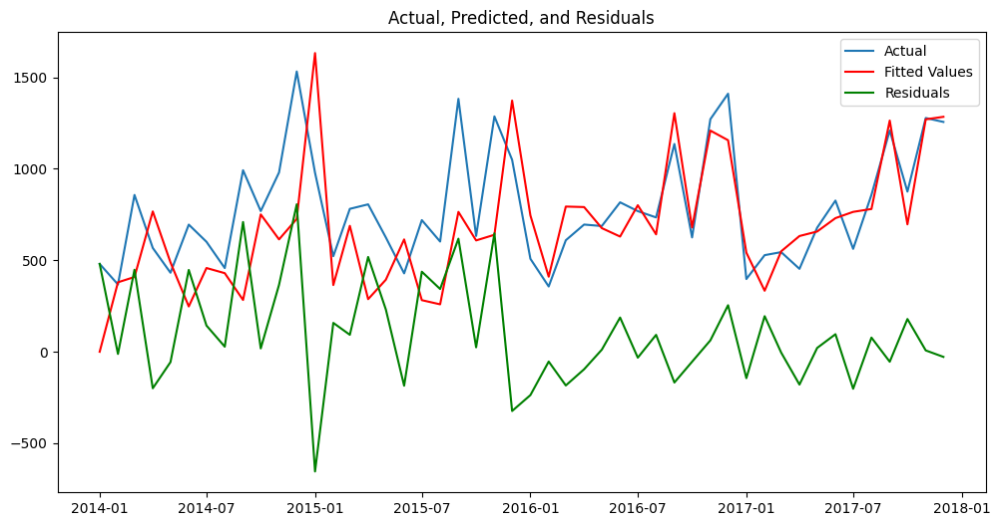
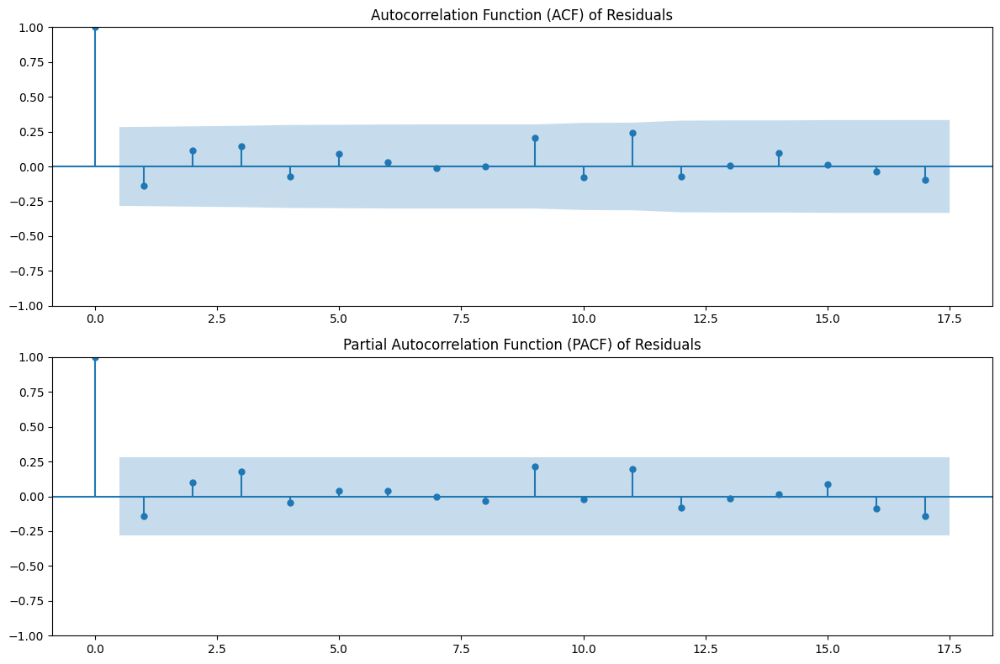

# Superstore-Time-Series-Prediction
## Prediction for Furniture 
##### This is the data for furniture.

##### ACF and PACF plot of the data.

##### Rolling mean and standard deviation to check stationarity.

##### Future sales prediction of SARIMA model.

##### Validating results on the actual data.

##### Actual, Predicted and Residuals after applying SARIMA.

##### ACF and PACF of the residuals.

## Prediction for Office Supplies

##### This is the data for Office Supplies.

##### ACF and PACF plot of the data.

##### Rolling mean and standard deviation to check stationarity.

##### Validating results on the actual data.

##### Future sales prediction of SARIMA model.

##### Actual, Predicted and Residuals after applying SARIMA.

##### ACF and PACF of the residuals.

